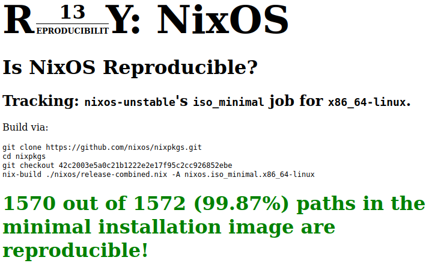

# Content

* Philosopher's Stone Certified Image Builds
* NixOS Philosopher's Stone System Image Content
  * System Content High Level
  * System Content package view
  * Build Variants
* Integration Tests
* Demo Session

# Philosopher's Stone


# Philosopher's Stone Certified Image Builds

BSI imposes **integrity** requirements on product/image builds

This project is a demo on how to build such images with nix/NixOS

<!-- It addresses all problems as described in the *build system problem paper* -->

# Typical Secure Network Product Requirements

* Bootable Image(s) with preconfigured Linux system(s)
* Pre-installed selection of packages
* Pre-configured services
* Minimized build
* Some packages are built\dots
  * from local source
  * from remote source with local **patches**
* Build flow shall be both reproducible and fast
* **Offline** build capability (integrity requirement)
  * must be *exportable* for evaluating parties

# What is NixOS?

* FOSS GNU/Linux Distribution
* Toolbox for building all kinds of system images
* Focus on **reproducible** builds and deployments
* Declarative package *and* system configuration
* Hybrid source/binary packaging mechanism
* Atomic system deployment, upgrade, rollback
* Simple toolchain maintenance included
* Hermetic builds *per package*
* Independence from complex Single-Point-of-Truth CIs

\

{ width=2in }

# Why NixOS? (1)



# Why NixOS? (2)


#

What are we going to build with it?

# Example System: High-Level View

```{ .plantuml
     caption="NixOS system running *some* example services"
     #fig:testsinglenode
   }
@startuml
skinparam dpi 500
left to right direction

node "NixOS System" as system {
  frame "Message Service" {
    database postgres [
      PostgreSQL DB
    ]
    component writer [
      writer service (C++)
    ]
    component reader [
      Reader web interface (Python)
    ]
  }

  writer --> postgres
  postgres --> reader

  frame "OpenSSH"
  frame "RDP Server" as rdp
}

actor actor1
actor1 --> writer : tcp1300
actor actor2
actor2 --> reader : tcp5000
actor actor3
actor3 --> rdp : tcp3389

@enduml
```

# Example System: Package View

Examples for how to *package* and *configure* a custom application service

* Message Server Writer
  * C++ app
  * Listens on port 1300, waits for messages
* Message Server Reader
  * Python app
  * HTTP Service, listens on port 5000, prints messages

\

minimal demo:
```sh
[stone@nixos:~]$ echo -n "hello world" | nc localhost 1300
ok
[stone@nixos:~]$ curl localhost:5000
2021-08-11: hello world

```

# Build Variants

* System config is *composable*
* Any system config can be transformed into different builds:
  * bootable ISO
    * live system
    * installer
  * runnable *shallow* NixOS-VM
  * integration test
  * Virtualbox VDI, Amazon AMI, Google Cloud Image, Azure, ...

# Dependency Graph

```{ .plantuml
     height=90%
   }
@startuml
skinparam dpi 500
left to right direction

node "System ISO" as iso #Orange
node "System VM" as vm #Orange
node "System VDI" as vdi #Orange

node "System Config" as config #LightBlue
node "Msg Reader" as reader #LightBlue
node "Msg Writer" as writer #LightBlue
node "hello stone" as hellostone #LightBlue
node "hello patch" as hellopatch #LightBlue

node "QEMU" as qemu #Grey
node "xorriso" as xorriso #Grey
node "VBox" as vbox #Grey

node "RDP" as rdp
node "OpenSSH" as ssh
node "PostgreSQL" as psql
node "libc" as libc
node "GNU hello" as gnuhello #Gray

node "CMake" as cmake #Grey
node "Python" as python

iso --> config
vm --> config
vdi --> config

vm --> qemu
iso --> xorriso
vdi -> vbox

hellostone --> gnuhello
hellostone --> hellopatch
gnuhello --> libc

config --> hellostone
config --> rdp
config --> ssh
config --> reader
config --> writer
config --> psql

reader --> psql
writer --> psql

rdp --> libc
ssh --> libc
reader --> libc
writer --> libc
psql --> libc


writer --> cmake
reader --> python
cmake --> libc

@enduml
```

# Dependency Graph Mapped to Company Structures

```{ .plantuml
     height=90%
   }
@startuml
skinparam dpi 500
left to right direction

node "System ISO" as iso #Orange
node "System VM" as vm #Orange
node "System VDI" as vdi #Orange

frame "Internal Repos" as repos {
  node "System Config" as config #LightBlue
  node "Msg Reader" as reader #LightBlue
  node "Msg Writer" as writer #LightBlue
  node "hello stone" as hellostone #LightBlue
  node "hello patch" as hellopatch #LightBlue
}

node "QEMU" as qemu #Grey
node "xorriso" as xorriso #Grey
node "VBox" as vbox #Grey

node "RDP" as rdp
node "OpenSSH" as ssh
node "PostgreSQL" as psql
node "libc" as libc
node "GNU hello" as gnuhello #Gray

node "CMake" as cmake #Grey
node "Python" as python

iso --> config
vm --> config
vdi --> config

vm --> qemu
iso --> xorriso
vdi -> vbox

hellostone --> gnuhello
hellostone --> hellopatch
gnuhello --> libc

config --> hellostone
config --> rdp
config --> ssh
config --> reader
config --> writer
config --> psql

reader --> psql
writer --> psql

rdp --> libc
ssh --> libc
reader --> libc
writer --> libc
psql --> libc


writer --> cmake
reader --> python
cmake --> libc

@enduml
```

# Demo Session

Bottom-up: How to\dots

* build the message-service packages
  * developer workflow
  * packaging workflow
* patch an external package and repackage it
* define a NixOS system image
* build multiple image configuration $\times$ variants
* integration test a running service in a VM
* rebuild the whole thing on an air-gapped system

# Integrating Nix Caches w/ Integrity Requirements

```{ .plantuml
     height=90%
   }
@startuml

label "No reuse of public builds.\n100% self-built from sources." as sourceslabel

frame "Airgapped Intranet" as gappedintranet {
  node "Central\nNix Cache" as gcache

  node "Developer\nMachine" as gvm1
  node "Developer\nMachine" as gvm2
  node "Developer\nMachine" as gvm3

  gcache <--> gvm1
  gcache <--> gvm2 : "Nix cache\nmechanism"
  gcache <--> gvm3
}

frame "Intranet w/ Internet Access" as intranet {
  node "Central\nNix Cache" as cache
  node "Developer\nMachine" as vm1
  node "Developer\nMachine" as vm2
  node "Developer\nMachine" as vm3

  node "Auditing\nDevOp" as devop

  cache <--> vm1
  cache <--> vm2
  cache <--> vm3
  cache --> devop

}

label "Quick & easy upgrades and toolchain\nswitches during development" as toolchainlabel

cloud "NixOS.org\ncache" as nixoscache

devop ..> gcache : "Closure Upload\n(only sources)"
nixoscache --> vm1
nixoscache --> vm2
nixoscache --> vm3

sourceslabel ~~ gcache #black

toolchainlabel ~~ cache #black
@enduml
```

# References from Demo Session

C++ and Cartesian build product variants:

https://blog.galowicz.de/2019/04/17/tutorial_nix_cpp_setup
https://blog.galowicz.de/2018/02/27/managing_libraries_with_nix
https://github.com/tfc/nix_cmake_example/

Nix(OS) Documentation:

* https://nixos.org/manual/nixos/stable
* https://nixos.org/manual/nix/stable
* https://nixos.org/manual/nixpkgs/stable

NixOS Wiki: https://nixos.wiki/

Nix.dev Community Tutorials: https://nix.dev/

Nix Overlays: https://nixos.wiki/wiki/Overlays

# Summary

The code on github:

https://github.com/tfc/philosophers-stone-nixos
